# Ontario Family Law Forms Workflow Diagram

## Complete Forms Ecosystem and Process Flow

```mermaid
flowchart TB
    Start([Family Law Matter Begins])
    
    %% Main Process Branches
    Start --> InitialAssessment{Type of Matter?}
    
    InitialAssessment --> Divorce[Divorce Process]
    InitialAssessment --> GeneralApp[General Application]
    InitialAssessment --> ChildProtection[Child Protection]
    InitialAssessment --> Adoption[Adoption]
    InitialAssessment --> Variation[Change Existing Order]
    InitialAssessment --> Enforcement[Enforcement]
    
    %% Service and Representation Forms (Always Available)
    subgraph ServiceForms[Service & Representation Forms - Always Available]
        F4[Form 4: Change in Representation]
        F6[Form 6: Acknowledgment of Service]
        F6A[Form 6A: Advertisement]
        F6B[Form 6B: Affidavit of Service]
        F6C[Form 6C: Lawyer's Certificate of Service]
    end
    
    %% DIVORCE PROCESS
    subgraph DivorceProc[Divorce Process]
        F8A[Form 8A: Application-Divorce]
        F36[Form 36: Affidavit for Divorce]
        F36A[Form 36A: Certificate of Clerk-Divorce]
        F36B[Form 36B: Certificate of Divorce]
        F25A[Form 25A: Divorce Order]
        F8A --> F36
        F36 --> F36A
        F36A --> F25A
        F25A --> F36B
    end
    
    %% GENERAL APPLICATION PROCESS
    subgraph GeneralProc[General Application Process]
        F8[Form 8: Application-General]
        F8_01[Form 8.01: Automatic Order]
        F10[Form 10: Answer]
        F10A[Form 10A: Reply]
        F12[Form 12: Notice of Withdrawal]
        F8 --> F8_01
        F8 --> F10
        F10 --> F10A
    end
    
    %% CHILD PROTECTION PROCESS
    subgraph ChildProtProc[Child Protection Process]
        F8B[Form 8B: Application-Child Protection]
        F8B1[Form 8B.1: Status Review-Extended Care]
        F8B2[Form 8B.2: Application-Other CYFSA]
        F8C[Form 8C: Application-Secure Treatment]
        F33B[Form 33B: Status Review Application]
        F33B1[Form 33B.1: Status Review-Indigenous Child]
        F33C[Form 33C: Statement of Agreed Facts]
        F33D[Form 33D: Plan of Care-Child Protection]
        F33E[Form 33E: Answer & Plan-Child Protection]
        F33F[Form 33F: Answer-Child Protection]
        F34[Form 34: Child's Consent to Treatment]
        F8B --> F33D
        F8B --> F33E
        F8B --> F33F
        F8B --> F33B
    end
    
    %% ADOPTION PROCESS
    subgraph AdoptionProc[Adoption Process]
        F8D[Form 8D: Application-Adoption]
        F8D1[Form 8D.1: Dispense Parent Consent]
        F8D2[Form 8D.2: Notice-Place for Adoption]
        F8D3[Form 8D.3: Notice-Indigenous Adoption]
        F8D4[Form 8D.4: Notice-Termination of Access]
        F34A[Form 34A: Affidavit-Adopting Parents]
        F34B[Form 34B: Non-Parent's Consent]
        F34C[Form 34C: Director's Consent-Crown Ward]
        F34D[Form 34D: Affidavit-Adoption Licensee]
        F34E[Form 34E: Director's Statement-Adoption]
        F34F[Form 34F: Parent's Consent-Adoption]
        F34G[Form 34G: Affidavit-Independent Legal Advice]
        F34H[Form 34H: Affidavit-Parent Identity]
        F34I[Form 34I: Director's Consent-Out of Province]
        F34J[Form 34J: Affidavit-Stepparent Adoption]
        F34K[Form 34K: Certificate-Adoption Administrator]
        F34L[Form 34L: Application-Openness Order]
        F34M[Form 34M: Consent-Openness Order]
        F34N[Form 34N: Application-Termination of Openness]
        F25C[Form 25C: Adoption Order]
        F8D --> F34A
        F8D --> F34F
        F34F --> F34G
        F8D --> F25C
    end
    
    %% FINANCIAL DISCLOSURE FORMS
    subgraph FinancialForms[Financial Disclosure - Required for Support/Property]
        F13[Form 13: Financial Statement-Support Only]
        F13_1[Form 13.1: Financial Statement-Property & Support]
        F13A[Form 13A: Certificate of Financial Disclosure]
        F13B[Form 13B: Net Family Property Statement]
        F13C[Form 13C: Comparison of NFP Statements]
        F27[Form 27: Request for Financial Statement]
        F27A[Form 27A: Request for Statement of Income]
        F27B[Form 27B: Statement of Income from Source]
        F27C[Form 27C: Appointment for Financial Examination]
        F13 --> F13A
        F13_1 --> F13A
        F13B --> F13C
    end
    
    %% MOTION PROCESS
    subgraph MotionProc[Motion Process]
        F14[Form 14: Notice of Motion]
        F14A[Form 14A: Affidavit-General]
        F14B[Form 14B: Motion Form]
        F14C[Form 14C: Confirmation of Motion]
        F14D[Form 14D: Order-Motion Without Notice]
        F14 --> F14A
        F14 --> F14B
        F14B --> F14C
    end
    
    %% VARIATION/CHANGE PROCESS
    subgraph VariationProc[Variation/Change Process]
        F15[Form 15: Motion to Change]
        F15A[Form 15A: Change Information Form]
        F15B[Form 15B: Response to Motion to Change]
        F15C[Form 15C: Consent Motion to Change]
        F15D[Form 15D: Consent-Change Child Support]
        F15 --> F15A
        F15 --> F15B
        F15C --> F15D
    end
    
    %% CONFERENCE PROCESS
    subgraph ConferenceProc[Conference Process]
        F17[Form 17: Conference Notice]
        F17A[Form 17A: Case Conference Brief-General]
        F17B[Form 17B: Case Conference Brief-Protection]
        F17C[Form 17C: Settlement Conference Brief-General]
        F17D[Form 17D: Settlement Conference Brief-Protection]
        F17E[Form 17E: Trial Management Conference Brief]
        F17F[Form 17F: Confirmation of Conference]
        F17G[Form 17G: Certificate of Dispute Resolution]
        F17 --> F17A
        F17 --> F17B
        F17A --> F17C
        F17B --> F17D
        F17C --> F17E
        F17D --> F17E
        F17E --> F17F
    end
    
    %% TRIAL PROCESS
    subgraph TrialProc[Trial Process]
        F20[Form 20: Request for Information]
        F20A[Form 20A: Authorization to Commissioner]
        F20B[Form 20B: Letter of Request]
        F20_1[Form 20.1: Acknowledgment-Expert Duty]
        F20_2[Form 20.2: Acknowledgment-Expert's Duty]
        F22[Form 22: Request to Admit]
        F22A[Form 22A: Response to Request to Admit]
        F23[Form 23: Summons to Witness]
        F23A[Form 23A: Summons-Witness Outside Ontario]
        F23B[Form 23B: Order-Prisoner's Attendance]
        F23C[Form 23C: Affidavit-Uncontested Trial]
        F20 --> F22
        F22 --> F22A
    end
    
    %% COURT ORDERS
    subgraph CourtOrders[Court Orders]
        F25[Form 25: Order-General]
        F25B[Form 25B: Secure Treatment Order]
        F25D[Form 25D: Order-Uncontested Trial]
        F25E[Form 25E: Notice Disputing Approval]
        F25F[Form 25F: Restraining Order]
        F25G[Form 25G: Restraining Order-Without Notice]
        F25H[Form 25H: Order Terminating Restraining Order]
        F25F --> F25H
        F25G --> F25H
    end
    
    %% ENFORCEMENT PROCESS
    subgraph EnforcementProc[Enforcement Process]
        F26[Form 26: Statement of Money Owed]
        F26A[Form 26A: Affidavit-Enforcement Expenses]
        F26B[Form 26B: Affidavit-Filing Contract]
        F26C[Form 26C: Notice-Transfer of Enforcement]
        F28[Form 28: Writ of Seizure and Sale]
        F28A[Form 28A: Request for Writ]
        F28B[Form 28B: Statutory Declaration to Sheriff]
        F28C[Form 28C: Writ of Temporary Seizure]
        F29[Form 29: Request for Garnishment]
        F29A[Form 29A: Notice-Garnishment Lump-Sum]
        F29B[Form 29B: Notice-Garnishment Periodic]
        F29C[Form 29C: Notice to Co-owner]
        F29D[Form 29D: Declaration-Indexed Support]
        F29E[Form 29E: Dispute-Payor]
        F29F[Form 29F: Dispute-Garnishee]
        F29G[Form 29G: Dispute-Co-owner]
        F29H[Form 29H: Notice-Garnishment Hearing]
        F29I[Form 29I: Notice-Stop Garnishment]
        F29J[Form 29J: Statement-Garnishee Financial Institution]
        F30[Form 30: Notice of Default Hearing]
        F30A[Form 30A: Request-Default Hearing]
        F30B[Form 30B: Default Dispute]
        F31[Form 31: Notice-Contempt Motion]
        F32[Form 32: Bond-Recognizance]
        F32A[Form 32A: Notice-Forfeiture Motion]
        F32B[Form 32B: Warrant for Arrest]
        F32C[Form 32C: Affidavit-Warrant of Committal]
        F32D[Form 32D: Warrant of Committal]
        F32_1[Form 32.1: Request-Enforce Arbitration Award]
        F32_1A[Form 32.1A: Dispute-Enforcement Request]
        F26 --> F28
        F26 --> F29
        F28 --> F28A
        F29 --> F29A
        F29 --> F29B
        F30 --> F30A
        F30A --> F30B
        F31 --> F32B
        F32B --> F32C
        F32C --> F32D
    end
    
    %% INTERJURISDICTIONAL SUPPORT
    subgraph InterjurisdictionalProc[Interjurisdictional Support]
        F37[Form 37: Notice-Confirmation of Provisional Order]
        F37A[Form 37A: Information-Support Application]
        F37B[Form 37B: Provisional Support Order]
        F37C[Form 37C: Notice-UIFSA Application Received]
        F37D[Form 37D: Notice-UIFSA Response Required]
        F37E[Form 37E: Notice-Confirmation Hearing]
        F37 --> F37A
        F37A --> F37B
        F37C --> F37D
        F37D --> F37E
    end
    
    %% DISPUTE RESOLUTION
    subgraph DisputeResolution[Alternative Dispute Resolution]
        F43[Form 43: BJDR Request and Consent]
        F43A[Form 43A: BJDR Request-OCL]
        F43B[Form 43B: Affidavit for BJDR]
        F43C[Form 43C: Confirmation of BJDR]
        F43 --> F43B
        F43A --> F43B
        F43B --> F43C
    end
    
    %% PROCESS CONNECTIONS
    Divorce --> DivorceProc
    GeneralApp --> GeneralProc
    ChildProtection --> ChildProtProc
    Adoption --> AdoptionProc
    Variation --> VariationProc
    Enforcement --> EnforcementProc
    
    %% Financial Disclosure Connections
    DivorceProc --> FinancialForms
    GeneralProc --> FinancialForms
    VariationProc --> FinancialForms
    
    %% Motion Connections
    GeneralProc --> MotionProc
    DivorceProc --> MotionProc
    ChildProtProc --> MotionProc
    
    %% Conference Connections
    GeneralProc --> ConferenceProc
    DivorceProc --> ConferenceProc
    ChildProtProc --> ConferenceProc
    
    %% Trial Connections
    ConferenceProc --> TrialProc
    
    %% Order Connections
    MotionProc --> CourtOrders
    TrialProc --> CourtOrders
    ConferenceProc --> CourtOrders
    
    %% Enforcement Connections
    CourtOrders --> EnforcementProc
    
    %% Interjurisdictional Connections
    GeneralProc -.-> InterjurisdictionalProc
    EnforcementProc -.-> InterjurisdictionalProc
    
    %% Dispute Resolution Connections
    GeneralProc -.-> DisputeResolution
    DivorceProc -.-> DisputeResolution
    
    %% Service Forms Connections (dashed lines to show availability)
    GeneralProc -.-> ServiceForms
    DivorceProc -.-> ServiceForms
    ChildProtProc -.-> ServiceForms
    AdoptionProc -.-> ServiceForms
    MotionProc -.-> ServiceForms
    EnforcementProc -.-> ServiceForms
    
    %% Highlighting Most Common Forms
    style F8 fill:#ffd700,stroke:#333,stroke-width:3px
    style F8A fill:#ffd700,stroke:#333,stroke-width:3px
    style F10 fill:#ffd700,stroke:#333,stroke-width:3px
    style F13 fill:#ffd700,stroke:#333,stroke-width:3px
    style F13_1 fill:#ffd700,stroke:#333,stroke-width:3px
    style F14 fill:#ffd700,stroke:#333,stroke-width:3px
    style F15 fill:#ffd700,stroke:#333,stroke-width:3px
    style F17A fill:#ffd700,stroke:#333,stroke-width:3px
    style F25 fill:#ffd700,stroke:#333,stroke-width:3px
    style F25A fill:#ffd700,stroke:#333,stroke-width:3px
    style F36 fill:#ffd700,stroke:#333,stroke-width:3px
    
    %% Color coding by process type
    style DivorceProc fill:#e6f3ff
    style GeneralProc fill:#ffe6e6
    style ChildProtProc fill:#fff0e6
    style AdoptionProc fill:#f0e6ff
    style FinancialForms fill:#e6ffe6
    style MotionProc fill:#ffe6f3
    style VariationProc fill:#f3e6ff
    style ConferenceProc fill:#e6f9ff
    style TrialProc fill:#ffe9e6
    style CourtOrders fill:#e6e6ff
    style EnforcementProc fill:#ffe6e6
    style InterjurisdictionalProc fill:#f0f0f0
    style DisputeResolution fill:#e6fff0
    style ServiceForms fill:#f5f5f5
```

## Legend

### Color Coding:
- **Gold Border**: Most commonly used forms
- **Light Blue**: Divorce Process
- **Light Pink**: General Application Process
- **Light Orange**: Child Protection Process
- **Light Purple**: Adoption Process
- **Light Green**: Financial Disclosure Forms
- **Rose**: Motion Process
- **Lavender**: Variation/Change Process
- **Sky Blue**: Conference Process
- **Peach**: Trial Process
- **Periwinkle**: Court Orders
- **Salmon**: Enforcement Process
- **Light Gray**: Interjurisdictional Support
- **Mint**: Alternative Dispute Resolution
- **Off-White**: Service & Representation Forms

### Line Types:
- **Solid Lines**: Primary process flow
- **Dashed Lines**: Optional or auxiliary processes

## Key Form Packages by Scenario

### 1. Uncontested Divorce Package:
- Form 8A (Application for Divorce)
- Form 36 (Affidavit for Divorce)
- Form 13 or 13.1 (if support/property involved)
- Form 25A (Divorce Order)
- Form 36B (Certificate of Divorce)

### 2. Contested Custody/Support Application:
- Form 8 (Application - General)
- Form 13 or 13.1 (Financial Statement)
- Form 10 (Answer)
- Form 17A (Case Conference Brief)
- Form 17C (Settlement Conference Brief)
- Form 25 (Order - General)

### 3. Motion to Change Support:
- Form 15 (Motion to Change)
- Form 15A (Change Information Form)
- Form 13 (Updated Financial Statement)
- Form 15B (Response - if contested)
- Form 25 (Order - General)

### 4. Enforcement Package:
- Form 26 (Statement of Money Owed)
- Form 27 (Request for Financial Statement)
- Form 29 (Request for Garnishment)
- Form 29A or 29B (Notice of Garnishment)
- Form 30 (Notice of Default Hearing - if needed)

### 5. Emergency Restraining Order:
- Form 14 (Notice of Motion)
- Form 14A (Supporting Affidavit)
- Form 25G (Restraining Order Without Notice)
- Form 6B (Affidavit of Service)

## Process Flow Notes

1. **Initial Filing**: Most cases begin with Form 8 series applications
2. **Service**: Form 6B (Affidavit of Service) is required after serving documents
3. **Financial Disclosure**: Forms 13/13.1 are mandatory for support/property claims
4. **Case Management**: All contested matters go through conference process (Form 17 series)
5. **Resolution**: Cases conclude with Form 25 series orders
6. **Post-Order**: Enforcement (Forms 26-32) or variation (Form 15) may follow

## Critical Timing Requirements

- **Answer (Form 10)**: Must be filed within 30 days of service
- **Motion (Form 14)**: Must be served at least 6 days before motion date
- **Conference Brief**: Must be filed according to case management timelines
- **Financial Statement**: Must be updated if more than 30 days old at key stages

This diagram represents the complete Ontario family law forms ecosystem, showing how each form fits into the overall legal process workflow.